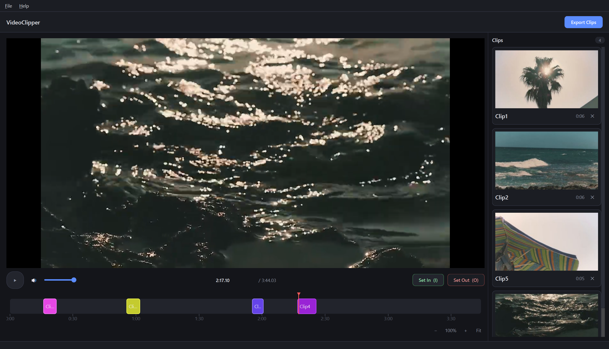
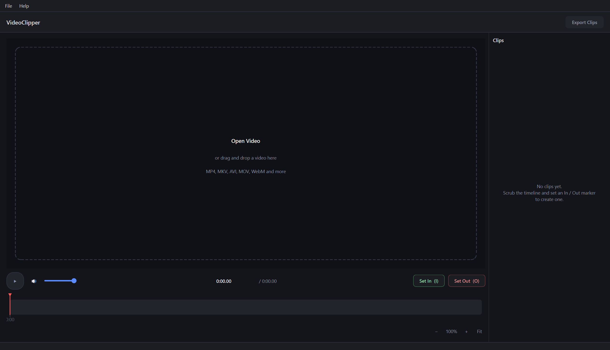
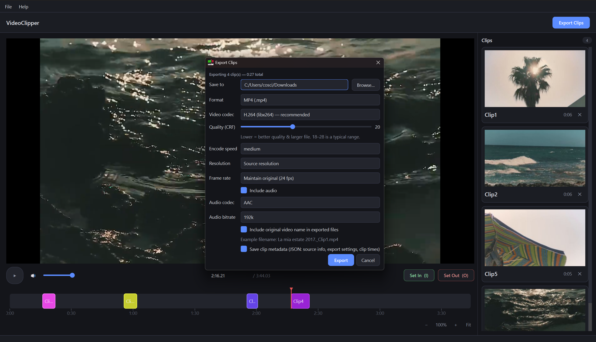
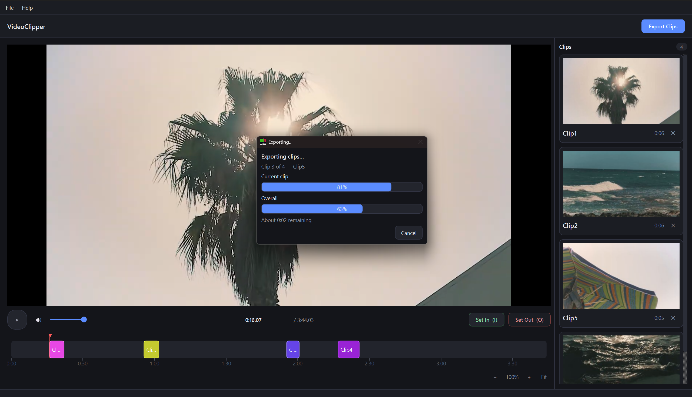

<h1 align="center">VideoClipper</h1>


<p align="center">A lightweight desktop app for trimming and organizing video clips.</p>

<p align="center">
   <b>Open a video, set in/out points of all the clips you want to extract, rename them and export them in one single click.</b><br>
   <b>No heavy UIs, no longer having to load Clipchamp for every video you want to process.</b><br>
</p>

<p align="center">


</p>


 

---

## Getting Started

### Installation

```bash
pip install -r requirements.txt
```

### Run

```bash
python videoclipper.py
```

## Overview

### Features

- **Timeline editing** — click and drag clip boundaries for frame-accurate trimming
- **Frame precision** — set frame-accurate in/out points with frame-by-frame navigation (↑/↓) and frame accurate timestamps
- **Project saving** — save your project as a JSON file that can be loaded afterwards to resume your work without losing any progress
- **Clips renaming** — rename your clips before export for maximum local file organization
- **Flexible formats** — works with MP4, MKV, AVI, MOV, WebM and more
- **Export settings** — export via copy or ffmpeg reencoding, bundled with PyAV (no separate install)

### Keyboard Shortcuts

| Key | Action |
| --- | --- |
| *Ctrl+S* | Save project |
| *Ctrl+Z* | Undo |
| *Ctrl+Shift+Z* | Redo |
| *Space* | Play / pause |
| *I* | Set in-point (or move selected clip's in-point) |
| *O* | Set out-point (or move selected clip's out-point) |
| *Esc* | Cancel a pending in-point |
| *←/→* | Seek 5s back/forward |
| *Shift+←/→* | Seek 1s back/forward |
| *↑/↓* | Step one frame forward/back (pauses) |
| *Home/End* | Jump to start/end |
| *Del* | Delete the selected clip (no confirmation) |

### Edit Menu

**Undo** and **Redo** (also **Ctrl+Z** / **Ctrl+Shift+Z**) step back and forward through in/out points, trims, renames, recolors, and deletes — up to 100 steps.

### Help Menu

For detailed instructions on how to use the app, you can always use the **Help** menu, which opens a quick reference including the shortcut table below plus a summary of mouse interactions, projects, and export settings — all without leaving the app.


## Usage

### Basic Workflow

1. **Load a video** — use **File > Open Video...**, click the button in the viewport, or drag and drop a video file onto the viewport (drag-and-drop works at any time, even with a video already loaded). The video loads paused on its first frame. Opening another video replaces the current one — if you have unsaved/unexported clips, you'll be asked to confirm first.

2. **Play and scrub** — press **Space** to play/pause, or click and drag the timeline to scrub through the video.

3. **Mark a clip** — press **I** (or click **Set In**) at the point where you want a clip to start, then scrub ahead and press **O** (or click **Set Out**) to close the clip. A colored block appears on the timeline and a card appears in the right panel. Clips cannot overlap.

4. **Trim clips** — drag either edge of a clip's block on the timeline to adjust its in or out point. The viewport follows your cursor so you can see exactly where you're cutting. Trims are clamped to prevent crossing into a neighboring clip.

5. **Organize clips** — click a clip's block to select it (highlighted in white). With a clip selected:
   - Press **I** or **O** to move its in/out point instead of creating a new clip
   - Press **Del** to delete it (no confirmation)
   - Double-click to rename it inline
   - Right-click for a menu with rename, recolor, or delete options
   
   Click empty timeline or anywhere else in the window to deselect.

6. **Preview clips** — click a clip card in the right panel to jump the viewport to that clip's start and play it. Playback auto-pauses at the clip's end. Any manual seek (dragging the timeline, arrow keys, Home/End) cancels that auto-stop.

7. **Resize the clip panel** — drag the divider between the viewport and the right panel to resize it. Cards scale with the panel width, and each thumbnail's aspect ratio matches the loaded video exactly (no empty space). The panel has a minimum width; dragging further past it collapses the panel entirely — drag the thin strip back out to restore it.

8. **Control playback** — use the speaker button and slider in the transport row to adjust volume and mute. The time readout in the middle displays the current position and total duration in the format `MM:SS.frame` (e.g., `2:10.15` = 2 minutes 10 seconds, frame 15). Click the current time readout to type a new position (same format or plain seconds) and jump there frame-accurately; press Escape or enter an invalid value to cancel without seeking.

9. **Zoom and pan the timeline** — use the mouse wheel to zoom in on whatever is under the cursor, or **Shift+wheel** to pan left/right when zoomed. The **−** / **+** / **Fit** buttons below the timeline zoom around the playhead instead. The zoomed view follows the playhead automatically during playback or seeking. Reopening a video resets zoom. Once zoomed, a scrollbar appears below the timeline for panning without a mouse — press **Tab** to focus it, then use **Left/Right/Home/End** or drag it like any scrollbar.

10. **Export clips** — click **Export Clips** (top right), choose an output folder and quality settings (see "Export Settings" below), then click **Export**. A progress dialog shows overall percent complete, estimated time remaining, and the current clip's encode progress, and closes automatically once export finishes. If an error occurs, the dialog stays open so you can read it.

### File Menu

- **Open Video...** — same as clicking the Open Video button in the viewport or dragging a video onto it
- **Save Project JSON...** (**Ctrl+S**) — saves the video path, all clips (name/start/end/color), and the last-used export settings to a JSON file. The first save asks for a location; after that, **Ctrl+S** saves straight back to that file. Use **Save Project JSON...** again to pick a different file
- **Open Project JSON...** — loads a saved project, restoring the clips and export settings and reopening its video. If the video has moved or been deleted, the clips still load (the timeline sizes itself to fit them) so you can relink it via Open Video. Asks for confirmation first if the current session has unsaved/unexported clips
- **Open Recent** — the last 10 saved/opened project files
- **Clear Recent Projects** — empties that list
- **Exit** — closes the app (same confirmation as the window's close button)

---

## Export Settings

| Setting | Details |
| --- | --- |
| **Copy** (no re-encode) | Fastest option. Cuts snap to the nearest keyframe (a clip may start slightly earlier than marked). Resolution/frame rate can't be changed. Not recommended if you need frame-precise in/out points. |
| **Re-encode** (H.264 / H.265 / VP9) | Frame-accurate cuts — decodes from the nearest keyframe and trims to the exact in-point before encoding. Allows resolution and frame rate changes. |
| **Quality (CRF)** | Constant-quality setting (same meaning as ffmpeg's). Lower = better quality, larger file. Typical range: 18–28. |
| **Resolution** | Scaled by height only; width is derived automatically to preserve aspect ratio. Works for any aspect ratio, not just 16:9. |
| **Frame rate** | Defaults to "Maintain original" (read from the source when the video loads). |
| **Include video name** | On by default. Names exports `{video_name}_{clip_name}.ext` instead of `{clip_name}.ext`. |
| **Save clip metadata** | On by default. Writes `{video_name}_clips_metadata.json` alongside the clips with source info, export settings, and each clip's name/file/start/end/duration. |


## Screenshots

**Startup state** — ready to open a video:



**Export dialog** — choose output folder, format, and quality settings:



**Render dialog** - report progress of rendering of current clip and across total number of clips:



## License

MIT License — see [LICENSE](LICENSE) for details.
